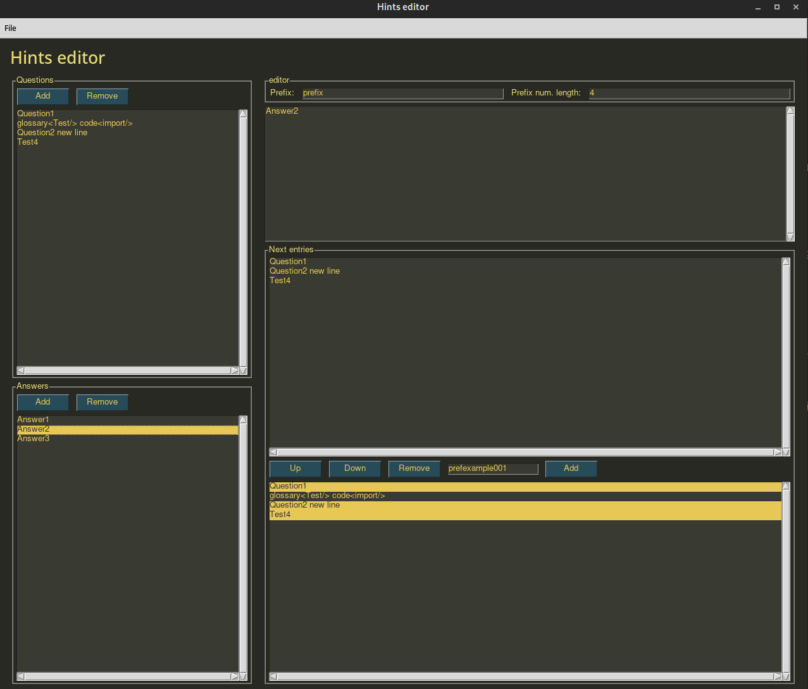

# Hints GUI-Editor

Mit diesem Tool lassen sich die Hinweise für
die [Bluestberry-Lernplattform](https://github.com/TU-Blueberry/bluestberry) erstellen erstellen.

## Datenmodell

Die Lernplattform nutzt zwei Arten von Hinweisen, Fragen und Antworten. Eine Frage kann eine Antwort als Nachfolger
haben, eine Antwort wiederum mehrere Fragen. Folgende Eigenschaften haben die jeweiligen Hinweise:

Fragen:

- ID für die Verarbeitung an oberster Stelle.
- `question_id` als ID für die Fragen.
- `following_answer_id` mit der ID für die nachfolgende Antwort. Wird auf `''` gesetzt, wenn keine nachfolgende Antwort
  erwünscht ist.
- `content` für den Inhalt der Frage. Kann auch mehrzeilig sein.

Antworten:

- ID für die Verarbeitung an oberster Stelle.
- `answer_id` als ID für die Antworten.
- `question_options` mit einer Liste an IDs für die nachfolgenden Fragen. Wird auf `[]` gesetzt, wenn keine
  nachfolgenden Fragen erwünscht sind.
- `content` für den Inhalt der Antwort. Kann auch mehrzeilig sein.

In einer Datei können gleiche `question_id` und `answer_id` vorkommen, solange diese nicht vom gleichen Typ sind.

Ein Beispiel befindet sich in der [hints_test.yml](test/resources/hints_test.yml).

## Bedienung

- Mit dem Tool können `.yml`-Dateien unter `File` geöffnet und bearbeitet werden. Beim Speichern werden geöffnete Dateien
  überschrieben
- Mit den `Add`-Buttons können neue Fragen oder Antworten erstellt werden. Anfangs haben sie keinen
  Nachfolger und keinen Inhalt.
- Mit den `Remove`-Buttons werden Fragen oder Antworten gelöscht. **Dieser Vorgang lässt sich nicht
  rückgängig machen!**
- Beim Klicken auf einen Hinweis auf der linken Seite wird der Editor für den Inhalt und der Teil des Tools für die
  Nachfolger geladen.
- Oben rechts lässt sich das Präfix und die länger der Zahl der ID einstellen. Beispielsweise kann mit `Prefix: prefix`
  und `Prefix num. length: 5` die ID `prefix00123` erzeugt werden.
- Diese IDs können durch weitere Skripte weiterverarbeitet oder ersetzt werden.
- Änderungen im Texteditor lassen sich mit den üblichen Tastenkombinationen rückgängig machen.
- Im unteren rechten Teil des Tools werden die darauffolgenden Hinweise durch das Klicken auf den jeweiligen Hinweis
  angepasst.
- Mit `Up` und `Down` kann die Reihenfolge der Hinweise angepasst werden.
- Mit `Add` und `Remove` können manuelle IDs hinzugefügt und entfernt werden.
- Am Anfang der Quelldatei [gui.py](hintstool/gui.py) lassen sich Standardwerte einstellen. Folgende Werte lassen sich
  anpassen:\
  `DEFAULT_PATH`, `DEFAULT_PREFIX`, `DEFAULT_LENGTH`, `AUTO_SAVE` (
  vgl. [Kommandozeilen-Argumente](#kommandozeilen-argumente))
- Falls gespeichert wird, ohne eine Datei anzugeben, wird der Inhalt in `backup.yml` gespeichert. Falls die automatische
  Speicherung an ist, lassen sich so Verluste von Daten bei Abstürzen vermeiden.

## Installation

0. Überspringe Schritt 2-4, falls sie schon von der IDE ausgeführt werden.
1. Installiere Python.
2. Erstelle eine "Virtual Environment", falls noch nicht vorhanden.
   Unter [Python documentation](https://packaging.python.org/en/latest/guides/installing-using-pip-and-virtual-environments/#creating-a-virtual-environment)
   finden sich mehr Informationen dazu.
3. Aktiviere die Umgebung.
4. Führe `pip install -r requirements.txt` im Ordner mit der `requirements.txt` aus.

## Ausführung

1. Vor der Verwendung sollten die Dateien, mit denen gearbeitet wird, gesichert werden.
2. Das GUI-Tool kann mit `py gui.py` ausgeführt werden.
3. Optional stehen noch Argumente zur Verfügung.

## Kommandozeilen-Argumente

- Mit `--path` wird direkt eine YAML-Datei in das Tool geladen.\
  Beispiel:`--path="test/resources/"`\
  Standardwert: `""`
- Mit `--prefix` wird das Präfix für die ID gesetzt.\
  Beispiel: `--prefix="prefix"`\
  Standardwert: `"prefix"`
- Mit `--default-len` wird die Länge der Zahl für die ID bestimmt. Bei weniger genutzten Ziffern werden die ersten
  Stellen mit 0 gefüllt.\
  Beispiel: `--default-len=6`\
  Standardwert: `4`
- Mit `--auto-save` werden automatisch bei Änderungen gespeichert.\
  Beispiel: `--auto-save=True`\
  Standardwert: `False`

## Lizenz

MIT-Lizenz (siehe [LICENSE](LICENSE))

[PySimpleGUI](https://github.com/PySimpleGUI/PySimpleGUI) ist lizenziert unter der GNU Lesser General Public License
v3.0 (siehe
[LGPLv3](dependencies/licenses/lgpl-3.0.md), [GPLv3](GPLv3)). Die für das Tool genutzt Version kann in
der `requirements.txt` oder direkt über pip geändert werden.

## Teilnehmerinnen und Teilnehmer

Projektleitung:

- Jun.-Prof. Dr. Thomas Liebig
- Lukas Pfahler

Organisation:

- Michael Schwarzkopf

Didaktik:

- Daniel Enders
- Jan Feider
- Leah Niechcial
- Isabell Strotkamp

Frontend-Entwicklung:

- Jana Gödeke
- Tim Hallyburton
- Tim Katzke
- Maximilian König
- Henri Schmidt

Unity-Entwicklung:

- Jonas Grobe
- Christofer Heyer 
